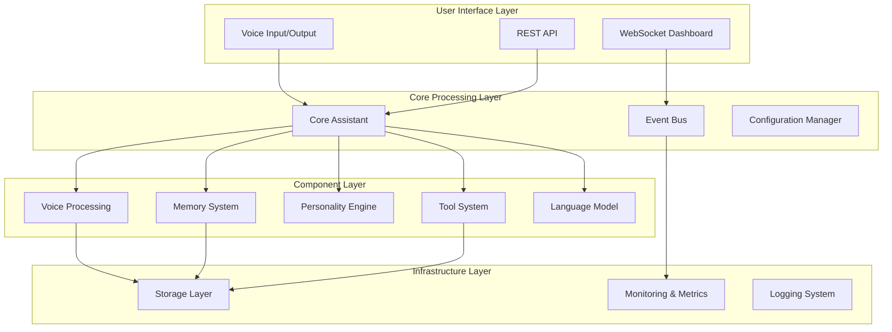

# Coda Architecture Overview

> **Modern, event-driven architecture for real-time voice interaction**
>
> **🎉 SYSTEM STATUS: 100% OPERATIONAL** - All components healthy with robust validation and auto-healing

## 🏗️ High-Level Architecture



## 📊 Current System Status

### **Component Health: 100% Operational** ✅

| Component | Status | Health Check | Details |
|-----------|--------|--------------|---------|
| **LLM Manager** | ✅ HEALTHY | All systems operational | Ollama qwen3:30b-a3b (17.3GB) responsive |
| **Memory Manager** | ✅ HEALTHY | Vector store functional | ChromaDB with embedding support |
| **Personality Manager** | ✅ HEALTHY | Behavioral conditioning active | Adaptive learning operational |
| **Voice Manager** | ✅ HEALTHY | Moshi integration working | Real-time processing enabled |
| **Tools Manager** | ⚠️ CONFIGURED | Security restrictions active | Operational with safety controls |

### **Model Infrastructure: All Accessible** ✅

| Model Type | Model | Status | Location | Performance |
|------------|-------|--------|----------|-------------|
| **LLM** | qwen3:30b-a3b | ✅ OPERATIONAL | Ollama localhost:11434 | Responsive, 17.3GB |
| **Voice** | kyutai/moshiko-pytorch-bf16 | ✅ CACHED | HuggingFace cache | Locally available |
| **GPU** | RTX 5090 | ✅ OPTIMAL | Hardware | 31.8GB VRAM, SM_120 |

### **System Integration: Fully Functional** ✅

- **CodaAssistant**: Successfully initializes and operates
- **Configuration**: Robust with auto-healing and validation
- **Model Validation**: Comprehensive health monitoring active
- **Error Handling**: Graceful fallbacks and recovery mechanisms
- **Performance**: Optimized for RTX 5090 hardware capabilities

## 🎯 Design Principles

### **1. Event-Driven Architecture**
- **Decoupled components** communicate via events
- **Real-time updates** through WebSocket events
- **Scalable processing** with async/await patterns

### **2. Local-First Design**
- **Privacy by design** - all processing happens locally
- **Offline capability** - works without internet connection
- **Optional cloud features** for enhanced capabilities

### **3. Modular & Extensible**
- **Plugin architecture** for easy component replacement
- **Interface-based design** for clean abstractions
- **Dependency injection** for testability

### **4. Real-Time Performance**
- **Streaming processing** for voice input/output
- **Sub-second latency** targets
- **Efficient batching** for multi-user scenarios

## 🧩 Core Components

### **Core Assistant (`src/coda/core/`)**
The central orchestrator that coordinates all components.

```python
class CodaAssistant:
    """Main assistant orchestrator"""
    
    def __init__(self, config: Config):
        self.voice = VoiceProcessor(config.voice)
        self.memory = MemoryManager(config.memory)
        self.personality = PersonalityEngine(config.personality)
        self.tools = ToolManager(config.tools)
        self.llm = LLMManager(config.llm)
        self.event_bus = EventBus()
    
    async def process_interaction(self, audio_input: bytes) -> bytes:
        # Main conversation loop
        pass
```

### **Voice Processing (`src/coda/components/voice/`)**
Handles speech-to-text and text-to-speech with streaming support.

**Current Implementation:**
- **STT**: Whisper-based with faster-whisper
- **TTS**: Multiple engines (ElevenLabs, MeloTTS, Dia TTS)

**Future (Kyutai Integration):**
- **Real-time streaming** STT/TTS
- **Voice cloning** capabilities
- **Semantic VAD** for natural conversation flow

### **Memory System (`src/coda/components/memory/`)**
Dual-layer memory with short-term and long-term storage.

```python
class MemoryManager:
    """Manages conversation memory and user preferences"""
    
    def __init__(self, config: MemoryConfig):
        self.short_term = ShortTermMemory(config.max_turns)
        self.long_term = LongTermMemory(config.vector_db)
        self.encoder = MemoryEncoder(config.embedding_model)
    
    async def add_interaction(self, user_input: str, assistant_response: str):
        # Store and process interaction
        pass
    
    async def get_relevant_context(self, query: str) -> List[Memory]:
        # Retrieve relevant memories
        pass
```

### **Personality Engine (`src/coda/components/personality/`)**
Adaptive personality system that learns from user interactions.

```python
class PersonalityEngine:
    """Manages assistant personality and behavioral adaptation"""
    
    def __init__(self, config: PersonalityConfig):
        self.parameters = PersonalityParameters(config.base_personality)
        self.conditioner = BehavioralConditioner(config.learning_rate)
        self.lore = PersonalLoreManager(config.lore_file)
    
    async def generate_response_style(self, context: ConversationContext) -> ResponseStyle:
        # Generate contextually appropriate response style
        pass
    
    async def learn_from_feedback(self, feedback: UserFeedback):
        # Adapt personality based on user feedback
        pass
```

### **Tool System (`src/coda/components/tools/`)**
Extensible tool ecosystem for function calling.

```python
class ToolManager:
    """Manages tool registration and execution"""
    
    def __init__(self, config: ToolConfig):
        self.router = ToolRouter()
        self.registry = ToolRegistry()
        self.executor = ToolExecutor()
    
    async def execute_tool(self, tool_name: str, parameters: Dict) -> ToolResult:
        # Execute tool with error handling
        pass
    
    def register_tool(self, tool: Tool):
        # Register new tool
        pass
```

## 🔄 Data Flow

### **Conversation Flow**
```
1. Audio Input → STT → Text
2. Text → Memory Context Retrieval
3. Text + Context → LLM Processing
4. LLM Response → Tool Detection/Execution
5. Final Response → Personality Styling
6. Styled Response → TTS → Audio Output
7. Interaction → Memory Storage
```

### **Event Flow**
```
Voice Events → Event Bus → Dashboard Updates
Memory Events → Event Bus → Analytics
Tool Events → Event Bus → Monitoring
Performance Events → Event Bus → Metrics
```

## 🚀 Performance Considerations

### **Latency Optimization**
- **Streaming processing** at each stage
- **Parallel component execution** where possible
- **Efficient memory retrieval** with vector search
- **Optimized model loading** and caching

### **Scalability**
- **Async/await** throughout the codebase
- **Connection pooling** for database operations
- **Batched processing** for multi-user scenarios
- **Resource monitoring** and auto-scaling

### **Memory Management**
- **Efficient data structures** for conversation storage
- **Automatic cleanup** of old conversations
- **Memory pooling** for audio processing
- **Garbage collection** optimization

## 🔧 Configuration System

### **Hierarchical Configuration**
```yaml
# configs/default.yaml
voice:
  stt:
    engine: "whisper"  # or "kyutai"
    model: "base"
    device: "cuda"
  tts:
    engine: "elevenlabs"  # or "kyutai"
    voice_id: "default"

memory:
  short_term:
    max_turns: 20
  long_term:
    enabled: true
    vector_db: "chroma"
    embedding_model: "all-MiniLM-L6-v2"

personality:
  base_personality: "helpful"
  adaptation_enabled: true
  learning_rate: 0.1

tools:
  enabled_tools:
    - "get_time"
    - "get_weather"
    - "search_memory"
```

### **Environment-Specific Overrides**
- **Development**: Enhanced logging, debug features
- **Production**: Optimized performance, monitoring
- **Testing**: Mock services, deterministic behavior

## 🔍 Monitoring & Observability

### **Metrics Collection**
- **Response latency** per component
- **Memory usage** and growth patterns
- **Tool usage** statistics
- **Error rates** and types

### **Real-Time Dashboard**
- **Live conversation** monitoring
- **Performance metrics** visualization
- **Memory state** inspection
- **System health** indicators

### **Logging Strategy**
- **Structured logging** with JSON format
- **Component-specific** log levels
- **Performance tracing** for optimization
- **Error tracking** with context

## 🧪 Testing Strategy

### **Unit Tests**
- **Component isolation** with mocks
- **Interface compliance** testing
- **Edge case** coverage
- **Performance benchmarks**

### **Integration Tests**
- **End-to-end** conversation flows
- **Component interaction** testing
- **Configuration validation**
- **Database operations**

### **Performance Tests**
- **Latency benchmarks** per component
- **Memory usage** profiling
- **Concurrent user** simulation
- **Stress testing** under load

## 🚀 Future Architecture Evolution

### **Kyutai Integration**
- **Streaming STT/TTS** with sub-second latency
- **Voice cloning** integration
- **Multi-user batching** support
- **Production-ready** Rust server integration

### **Multi-Modal Expansion**
- **Vision processing** for image understanding
- **Document analysis** capabilities
- **Screen interaction** automation
- **Cross-modal** memory integration

### **Distributed Architecture**
- **Microservices** decomposition
- **Container orchestration** with Kubernetes
- **Load balancing** and auto-scaling
- **Cross-device** synchronization

---

This architecture provides a solid foundation for building a next-generation voice assistant while maintaining flexibility for future enhancements and integrations.
